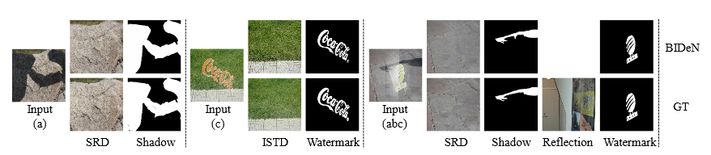

[arXiv](https://arxiv.org/abs/2108.11364), [porject page](https://junlinhan.github.io/projects/BID.html), [paper](https://arxiv.org/pdf/2108.11364.pdf)

# Blind Image Decomposition (BID)
Blind Image Decomposition is a novel task. The task requires separating a superimposed image into constituent underlying images in a blind setting, that is, both the source components involved in mixing as well as the mixing mechanism are unknown.

We invite our community to explore the novel BID task, including discovering interesting areas of application, developing novel methods, extending the BID setting,and constructing benchmark datasets.

[Blind Image Decomposition](https://arxiv.org/pdf/2108.11364.pdf)<br>
[Junlin Han](https://junlinhan.github.io/), Weihao Li, Pengfei Fang, Chunyi Sun, Jie Hong, Ali Armin, [Lars Petersson](https://people.csiro.au/P/L/Lars-Petersson), [Hongdong Li](http://users.cecs.anu.edu.au/~hongdong/)<br>
DATA61-CSIRO and Australian National University<br>
Preprint

BID demo:


# BIDeN (Blind Image Decomposition Network):

 
## Applications of BID 

**Deraining (rain streak, snow, haze, raindrop):**

<br>
Row 1-6 presents 6 cases of a same scene.  The 6 cases are (1):  rainstreak, (2): rain streak + snow, (3): rain streak + light haze, (4): rain streak + heavy haze, (5): rain streak + moderate haze + raindrop, (6)rain streak + snow + moderate haze + raindrop.
<br>

**Joint shadow/reflection/watermark removal:**


## Prerequisites
Python 3.7 or above.

For packages, see requirements.txt.

### Getting started

- Clone this repo:
```bash
git clone https://github.com/JunlinHan/BID.git
```

- Install PyTorch 1.7 or above and other dependencies (e.g., torchvision, visdom, dominate, gputil).

  For pip users, please type the command `pip install -r requirements.txt`.

  For Conda users, you can create a new Conda environment using `conda env create -f environment.yml`. (Recommend)
  
  We tested our code on both Windows and Ubuntu OS.

### BID Datasets

- Download BID datasets: https://drive.google.com/drive/folders/1wUUKTiRAGVvelarhsjmZZ_1iBdBaM6Ka?usp=sharing

  unzip the downloaded datasets, put them inside `./datasets/`.

### BID Train/Test
- Detailed instructions are provided at `./models/`.
- To view training results and loss plots, run `python -m visdom.server` and click the URL http://localhost:8097.

**Task I: Mixed image decomposition across multiple domains:**

Train (biden n, where n is the maximum number of source components):
```bash
python train.py --dataroot ./datasets/image_decom --name biden2 --model biden2 --dataset_mode unaligned2
python train.py --dataroot ./datasets/image_decom --name biden3 --model biden3 --dataset_mode unaligned3
...
python train.py --dataroot ./datasets/image_decom --name biden8 --model biden8 --dataset_mode unaligned8
```

Test a single case (use n = 3 as an example):
```bash
Test a single case:
python test.py --dataroot ./datasets/image_decom --name biden3 --model biden3 --dataset_mode unaligned3 --test_input A
python test.py --dataroot ./datasets/image_decom --name biden3 --model biden3 --dataset_mode unaligned3 --test_input AB
```
... ane other cases.
change test_input to the case you want.

Test all cases:
```bash
python test2.py --dataroot ./datasets/image_decom --name biden3 --model biden3 --dataset_mode unaligned3
```

**Task II: Real-scenario deraining:**

Train:
```bash
python train.py --dataroot ./datasets/rain --name task2 --model rain --dataset_mode rain
```

**Task III: Joint shadow/reflection/watermark removal:**

Train:
```bash
python train.py --dataroot ./datasets/jointremoval_v1 --name task3_v1 --model jointremoval --dataset_mode jointremoval
or
python train.py --dataroot ./datasets/jointremoval_v2 --name task3_v2 --model jointremoval --dataset_mode jointremoval
```

The test results will be saved to an html file here: `./results/`.

### Apply a pre-trained BIDeN model
We provide our pre-trained BIDeN models at: https://drive.google.com/drive/folders/1UBmdKZXYewJVXHT4dRaat4g8xZ61OyDF?usp=sharing

Download the pre-tained model, unzip it and put it inside ./checkpoints.

Example usage: Download the dataset of task II (rain) and pretainred model of task II (task2). Test the rain streak case.
```bash
python test.py --dataroot ./datasets/rain --name task2 --model rain --dataset_mode rain --test_input B 
```

### Evaluation
For FID score, use [pytorch-fid](https://github.com/mseitzer/pytorch-fid).

For PSNR/SSIM/RMSE, see `./metrics/`.

### Raindrop effect
See `./raindrop/`.

### Citation
If you use our code or our results, please consider citing our paper. Thanks in advance!
```
@inproceedings{han2021bid,
  title={Blind Image Decomposition},
  author={Junlin Han and Weihao Li and Pengfei Fang and Chunyi Sun and Jie Hong and Mohammad Ali Armin and Lars Petersson and Hongdong Li},
  booktitle={arXiv preprint arXiv:2108.11364},
  year={2021}
}
```

### Contact
junlin.han@data61.csiro.au or junlinhcv@gmail.com

### Acknowledgments
Our code is developed based on [DCLGAN](https://github.com/junlinhan/DCLGAN) and [CUT](http://taesung.me/ContrastiveUnpairedTranslation/).
We thank the auhtors of [MPRNet](https://github.com/swz30/MPRNet), [perceptual-reflection-removal](https://github.com/ceciliavision/perceptual-reflection-removal), [Double-DIP](https://github.com/yossigandelsman/DoubleDIP), [Deep-adversarial-decomposition](https://github.com/jiupinjia/Deep-adversarial-decomposition) for sharing their source code.
We thank [exposure-fusion-shadow-removal](https://github.com/tsingqguo/exposure-fusion-shadow-removal) and [ghost-free-shadow-removal](https://github.com/vinthony/ghost-free-shadow-removal) for providing the source code and results.
We thank [pytorch-fid](https://github.com/mseitzer/pytorch-fid) for FID computation.

